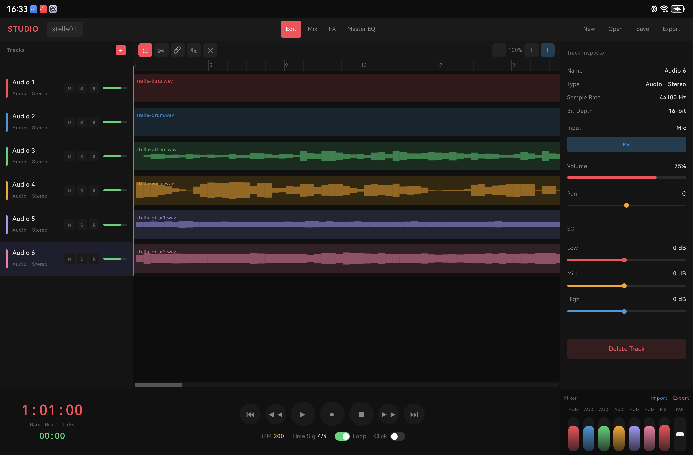
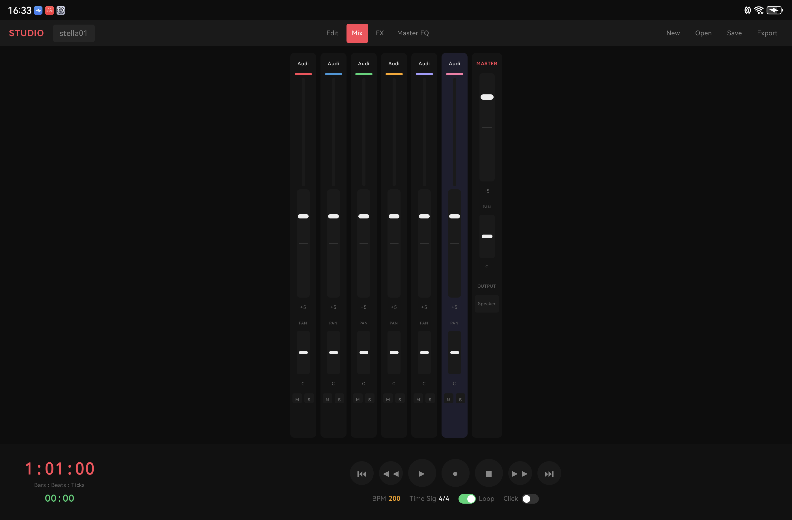
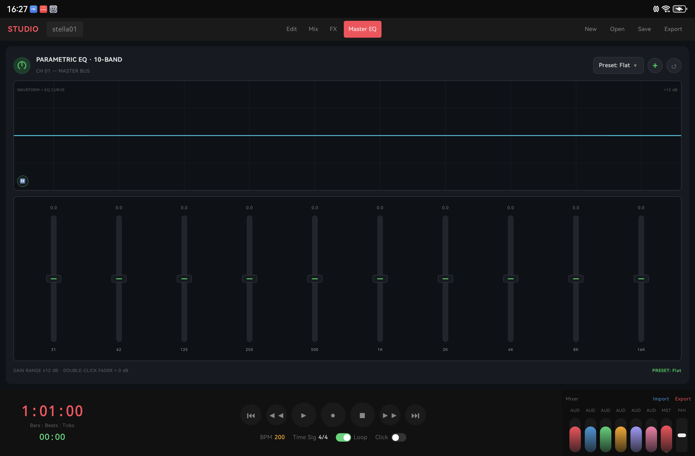
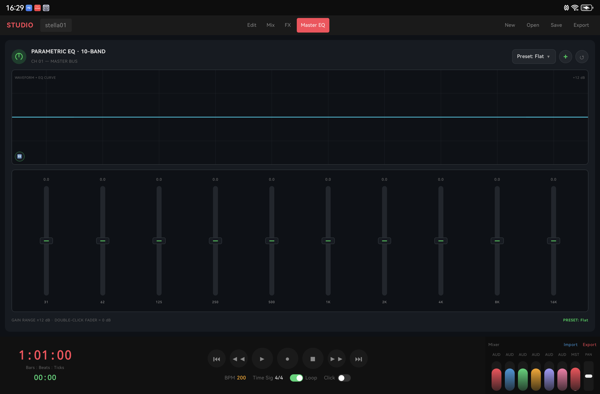

# SoundBreaker Studio

Android DAW (Digital Audio Workstation) application built with Kotlin and Jetpack Compose.

## Screenshots

### Edit Tab


### Mix Tab


### FX Tab


### Master EQ Tab


## Features

### Audio
- Record stereo audio (44.1kHz, 16-bit PCM)
- Import WAV, AIFF, MP3, AAC, M4A files
- Automatic resampling to 44.1kHz for all formats
- WAV header parsing with JUNK/non-standard chunk support
- Export to WAV
- Multi-track playback with real-time mixing

### Editing
- Select, delete, cut audio regions
- Move regions via drag or nudge buttons
- Region-aware playback (audio follows region position on timeline)
- Timeline with configurable bars, tap to set playhead position

### BPM
- Editable BPM with dialog input (displays current value)
- Region width scales proportionally when BPM changes
- Metronome click track (toggle on/off)

### Mixer (Mix Tab)
- Per-channel volume faders
- Per-channel pan controls
- Master volume and pan
- Mute / Solo per track
- Real-time level meters during playback
- Audio output device selection (Speaker, USB, etc.)

### Effects (FX Tab)
- Per-track effect chain management
- 6 built-in effects: Compressor, Reverb, Delay, Chorus, Distortion, Filter
- Toggle enable/disable per effect
- Adjustable parameters per effect with sliders

### Master EQ
- 10-band graphic equalizer (31Hz - 16kHz)
- Preset system (Flat, Bass, Vocal, Bright, V-Shape, etc.)
- Custom preset save/load
- Power toggle (bypass)
- Canvas waveform + EQ curve visualization
- Applied post-mix, pre-master-volume

### Track Controls
- Mute / Solo / Record arm per track
- Per-track volume and pan
- Per-track 3-band EQ (Low, Mid, High)
- Track rename (double-tap)
- Add / Remove tracks
- Audio input source selection per track

### Inspector
- Volume, Pan controls
- 3-band EQ sliders
- Sample rate and bit depth display
- Delete track button

### Visualization
- Waveform display (symmetric filled envelope)
- 60fps smooth playhead with auto-scroll
- Zoom in/out timeline
- Dynamic level meters during playback

### Project Management
- Save/Open projects (.sbrk format)
- Custom project names
- All track settings persisted (volume, pan, EQ, effects, regions)
- Master EQ settings persisted
- File structure: `project_name.sbrk/project.json + track_N.wav`

## Tech Stack
- **Language**: Kotlin
- **UI**: Jetpack Compose
- **Architecture**: MVVM
- **Audio**: AudioTrack (playback), AudioRecord (recording), MediaCodec (decode)
- **Target**: Tablet Landscape (primary)
- **Min SDK**: 26 (Android 8.0)
- **Target SDK**: 36

## Project Structure

```
app/src/main/java/id/soundbreaker/studio/
├── MainActivity.kt
├── audio/
│   ├── AudioEngine.kt           (playback, recording, mixing, WAV read/write, resampling)
│   ├── MasterEqProcessor.kt     (10-band biquad EQ DSP)
│   ├── BiquadFilter.kt          (biquad filter implementation)
│   ├── EffectsProcessor.kt      (per-track effects chain)
│   └── TrackEffectsChain.kt     (effect state management)
├── data/
│   ├── Track.kt                 (data models: Track, AudioRegion, Effect, ProjectState)
│   └── ProjectData.kt           (JSON serialization for save/load)
├── ui/
│   ├── theme/
│   │   ├── Color.kt
│   │   └── Theme.kt
│   ├── components/
│   │   ├── TopBar.kt            (tabs, New, Open, Save, Export)
│   │   ├── TrackListItem.kt     (track list with M/S/R)
│   │   ├── Timeline.kt          (ruler, track lanes, waveform rendering)
│   │   ├── InspectorPanel.kt    (volume, pan, EQ, sample rate info)
│   │   ├── TransportBar.kt      (play/pause/stop/record, BPM, click)
│   │   ├── MiniChannelFader.kt  (mini mixer faders in Edit view)
│   │   └── TimelineScrollBar.kt (horizontal scrollbar)
│   └── screens/
│       ├── StudioScreen.kt      (main layout with tab switching)
│       ├── MixScreen.kt         (full mixer console with channel strips)
│       ├── FxScreen.kt          (per-track effects chain editor)
│       └── MasterEqScreen.kt    (10-band parametric EQ UI)
└── viewmodel/
    └── StudioViewModel.kt       (state management, audio engine control)
```

## Build

```bash
JAVA_HOME=/opt/android-studio/jbr ./gradlew assembleDebug
adb install -r app/build/outputs/apk/debug/app-debug.apk
```

## Permissions
- `RECORD_AUDIO` - for audio recording
- `MODIFY_AUDIO_SETTINGS` - for audio configuration
- `MANAGE_EXTERNAL_STORAGE` - for save/load projects

## File Format

### Save Project (.sbrk folder)
```
project_name.sbrk/
├── project.json    (settings, track metadata, regions, effects, EQ)
├── Audio 1.wav     (audio files per track)
├── Audio 2.wav
└── ...
```

### project.json structure
```json
{
  "name": "My Project",
  "bpm": 120,
  "isLooping": true,
  "isClickOn": false,
  "masterEq": [0, 0, 0, 0, 0, 0, 0, 0, 0, 0],
  "masterEqPreset": "Flat",
  "masterEqEnabled": true,
  "tracks": [
    {
      "id": 1,
      "name": "Audio 1",
      "type": "AUDIO_STEREO",
      "color": "#FF4757",
      "volume": 0.75,
      "pan": 0.5,
      "audioFile": "Audio 1.wav",
      "channels": 2,
      "bitDepth": 16,
      "eqLow": 0,
      "eqMid": 0,
      "eqHigh": 0,
      "regions": [
        {
          "id": 101,
          "name": "audio.wav",
          "startBar": 1.0,
          "widthBars": 75.08
        }
      ],
      "effects": [
        {
          "id": 53104,
          "name": "Reverb",
          "icon": "reverb",
          "isEnabled": true,
          "params": { "amount": 0.3, "decay": 0.5 }
        }
      ]
    }
  ]
}
```
