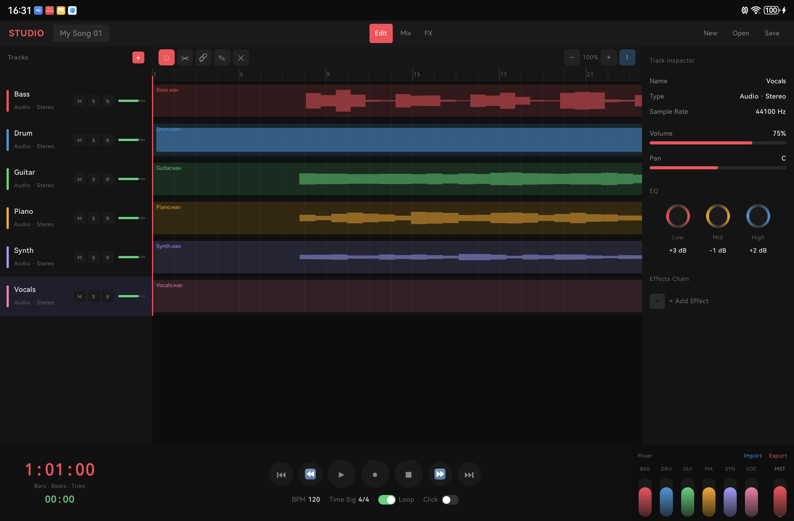

# SoundBreaker Studio

Android DAW (Digital Audio Workstation) application built with Kotlin and Jetpack Compose.



## Features

### Audio
- Record stereo audio (44.1kHz, 16-bit PCM)
- Import WAV, AIFF, MP3, AAC files
- Export to WAV
- Multi-track playback with real-time mixing

### Editing
- Select, delete, cut audio regions
- Move regions via drag or nudge buttons (◀ ▶)
- Timeline with 200 bars, tap to set playhead position

### Visualization
- Waveform display (symmetric filled envelope)
- 60fps smooth playhead with auto-scroll
- Zoom in/out timeline

### Project Management
- Save/Open projects (.sbrk format)
- Custom project names
- File structure: `project_name.sbrk/project.json + track_N.wav`

### Track Controls
- Mute / Solo / Record arm
- Volume per track
- Track rename (double-tap)
- Add / Remove tracks

### Inspector
- Volume, Pan controls
- 3-band EQ knobs
- Effects chain (Compressor, Reverb, De-Esser)
- Sample rate display

## Tech Stack
- **Language**: Kotlin
- **UI**: Jetpack Compose
- **Architecture**: MVVM
- **Target**: Tablet Landscape (primary)
- **Min SDK**: 26 (Android 8.0)
- **Target SDK**: 36

## Project Structure

```
app/src/main/java/id/soundbreaker/studio/
├── MainActivity.kt
├── audio/
│   └── AudioEngine.kt          (record, playback, WAV read/write, resampling)
├── data/
│   ├── Track.kt                (data models)
│   └── ProjectData.kt          (JSON serialization)
├── ui/
│   ├── theme/
│   │   ├── Color.kt
│   │   └── Theme.kt
│   ├── components/
│   │   ├── TopBar.kt           (New, Open, Save, tabs)
│   │   ├── TrackListItem.kt    (track list with M/S/R)
│   │   ├── Timeline.kt         (ruler, track lanes, waveform)
│   │   ├── InspectorPanel.kt   (volume, pan, EQ, effects)
│   │   ├── TransportBar.kt     (play/pause/stop/record)
│   │   └── MiniChannelFader.kt (mixer faders)
│   └── screens/
│       └── StudioScreen.kt     (main 3-panel layout)
└── viewmodel/
    └── StudioViewModel.kt      (state management, audio engine)
```

## Build

```bash
./gradlew installDebug
```

Or open in Android Studio and run.

## Permissions
- `RECORD_AUDIO` - for audio recording
- `MODIFY_AUDIO_SETTINGS` - for audio configuration
- `MANAGE_EXTERNAL_STORAGE` - for save/load projects

## File Format

### Save Project (.sbrk folder)
```
project_name.sbrk/
├── project.json    (settings, track metadata, regions)
├── track_1.wav     (audio files)
└── track_2.wav
```

### project.json structure
```json
{
  "name": "My Project",
  "bpm": 120,
  "isLooping": true,
  "tracks": [
    {
      "id": 1,
      "name": "Audio 1",
      "type": "AUDIO_STEREO",
      "color": "#FF4757",
      "audioFile": "Audio 1.wav",
      "regions": [...]
    }
  ]
}
```
